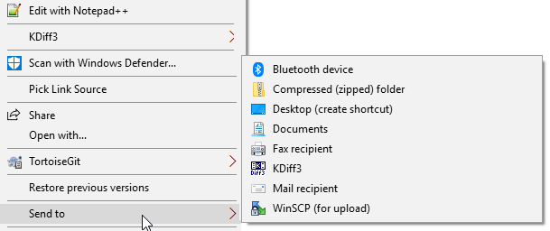
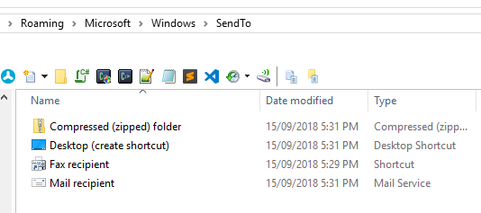
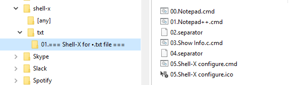
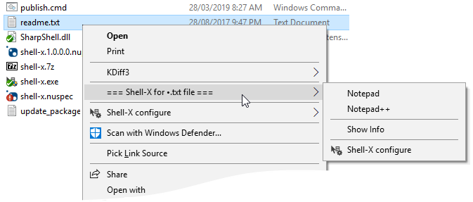

# Shell-X

[](https://oleg-shilo.github.io/cs-script/Donation.html)


_**Dynamic customizable file context menu solution for Windows.
Allows creating context menus of any complexity without the need to compile COM shell extensions. The solution is based on the same concept as Windows Explorer native "Send to" context menu.**_

## Overview

In Windows Explorer context menus are an extremely important part of the User Experience (UX). Just a single right-click on the file allows a convenient access to the file type specific operations.

Unfortunately creation and customization context menus were always a pain point. The problem is that Windows implements explorer context menus as so called _Shell Extensions_. They are a heavy weight COM servers that is not trivial to implement. And what is even more important they are components that must be rebuild/recompiled every time user wants to change the menu structure or the associated menu action. And this in turn dramatically affects the user adoption of context menus as an operating system feature.  

Interestingly enough Windows has introduces an alternative light way for managing very specific context menu - "Send to".



The customisation of the "Send to" is dead simple. User simply goes to the special folder and creates there shortcut(s) to the desired application. Then at runtime the shortcut name will become the content menu item. And shortcut itself will be invoked (with the selected file path passed as an argument) when user selects this menu item.



This means that creation and customization of the "Send to" context menu is a simple file creation/editing activity that does not even require user to be an admin (elevated).

Shell-X applies the same simplified approach but extends it by allowing creation of any context menu for any file type.

Below are the some of Shell-X features that extend Windows "Send to" approach:

* Support for complex nested context menus.
* Support for console and windows menu actions.
* Support for both batch files and PowerShell scripts as an action associated with a menu item.
* Support for custom icons in the menu items.
* The action definition is no longer a shortcut but a batch file so a menu action can have multiple steps.
* Definitive menu items order thanks to the use of the sortable prefixes in the file names.
* Individual context menu definitions for file types based on the file extension.

## Installation

_With Chocolatey_

Install package _Shell-X_:

```PS
choco install shell-x
```

_Manually_

- Download the release package and unzip its content in any location.
- Execute the following two commands in the command prompt
  ```
  shell-x -r
  shell-x -init
  ```
To uninstall just execute:
  ```
  shell-x -unregister
  ```
  Note, the explorer may lock the extension file so yuou may need to restart it before you can the file. 

_Configuration_

After the installation the sample context menu (as described in the next section) will be created. Do modify and extend it as you wish by creating properly name batch files in the configuration folder as described in the next section.

You can open configuration folder any time by executing the _open_ command in command prompt:

```
shell-x -open
```

There is also an option (v1.4.0+) for testing the configuration outside of the Windows explorer

```
shell-x -test [path]
```
It is helpful for refining the mapping of the configuration to the selected item (path) actions.


## How it works

Shell-X maintains a global directory, which file tree structure defines the complex context menu tree to be displayed at runtime on right click.

The root folders are named according the file extension that the context menu is for. Thus the folder `txt` contains context menu definition for all text files, the `dll` folder is for all DLLs. And there are two special folder names:
- `[any]` that defines the context menu for any file or a folder.
- `[folder]` that defines the context menu for any folder.
- `[file]` that defines the context menu for a file.


Below is the example of the configuration for two separate context menus for text files and for any file.



And this is how the menus look at runtime.



In the example above the context menu for txt files has a complex structure containing sub-menus for opening selected file with Notepad and other file handling operations.

The content of _00.Notepad.cmd_ file is an ordinary batch file content:
```
notepad.exe %*
```

Since the menu items are composed according the configuration folder file structure naming the files it is vital the proper naming convention is followed:

* File name
  ```
  <two_digits_order_prefix>.<menu_item_name>[.c][.ms].<cmd|bat|ps1>
  ```

* By default the batch file is executed with the console window hidden. If you prefer console being visible include `.c` suffix before the batch file extension.

* `.ms` in the file name has special meaning. It indicates that the batch file supports multi-select scenario. Thus if multiple files are selected and executed against the shell extension menu item then every file will be executed in it's own process of the corresponding batch file. Otherwise, by default, all files are passed to a single batch file.


* If you want the menu item to have the icon then place the icon file in the same folder where the corresponding batch file is and give it the same file name as the batch file but with the _".ico"_ extension:
  ```
  05.Shell-X configure.cmd
  05.Shell-X configure.ico
  ```
  
Note, you can use wild card expression as the folder name that encodes the pattern for the file name (of the file that is right clicked).
However, since the wild card characters are prohibited by the file system you will need to use special characters that looke like the special wild card characters but are in fact special Unicode characters that are safe to use as folder names:

```C#
// The unicode characters that look like ? and * but still allowed in dir and file names
 string safeQuestionMark = "？"; 
 string safeAsterisk = "⁎";
``` 
Simply copy the characters from this description, compose the desired pattern in the text editor and then paste the pattern in the file explorer as a folder name.

Thus your desired pattern for files cmn.ar.00, cmn.ar.01,. . .
will look like this: ⁎.ar.⁎.  

## Limitations

* When user right-click a file and the plugin is loaded for the very first time there is a noticable delay (~3-5 seconds) before the menu pops up. This is a Windows Explorer one off limititation and any subsequent right-clicks bring context menu instantly.


